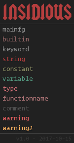

<p align="center">
  
</p>

<p align="center"><b>I N S I D I O U S</b></p>

---

A dark theme for Emacs. Inspired by <a href="https://open.spotify.com/album/0KQyC28P9808r0oKKNgHvp">Doom</a> (2016) soundtrack.

Current Version: 1.1
<br>
Date: 15-10-2017
<br>
Last Update: 23-10-2018
<br>
Website: <a href="https://trevorwoodman.ca">trevorwoodman.ca</a>
<br>
Latest Release: <a href="https://github.com/turbits/insidious/releases/download/v1.1/insidious-theme.el"><b>Insidious_v1.1</b></a>
<br>
Old Releases:
<br>
-> <a href="https://github.com/turbits/insidious/releases/download/v1.0/insidious-theme.el">Insidious_v1.0</a>

---

##### Installation:

1. Insert low in .emacs: (load "~/.emacs.d/insidious-theme.el")

---

##### Config:

If you don't want Insidious to highlight lines for you, remove this from the theme file:
```
;; set line highlight
(global-hl-line-mode 1)
(set-face-background 'hl-line "gray3")
```

---


---

